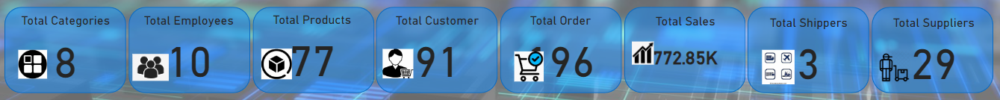

# Sales-Analytics
This repository is for the sales analysis performed on PowerBi leveraging several tables (facts and dimensions)

### Summary Statistics

In the above image, it can be observed that we have a total of 77 products which are under 7 categgories supplied by a total of 29 supppliers, a total of 10 employees that attend to customer's orders, 91 customer base with a total of 96 orders, a total sales of about ~$773K, and we have 3 shippers that handles the delivery of the orders.